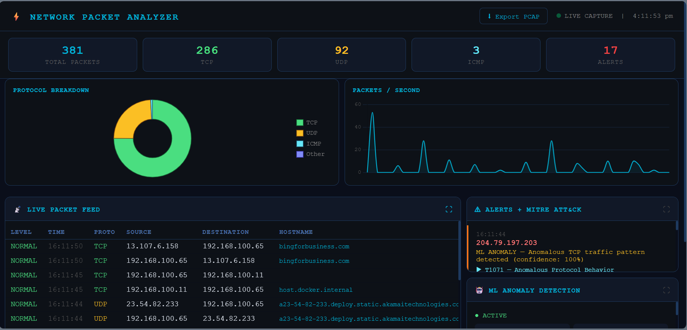
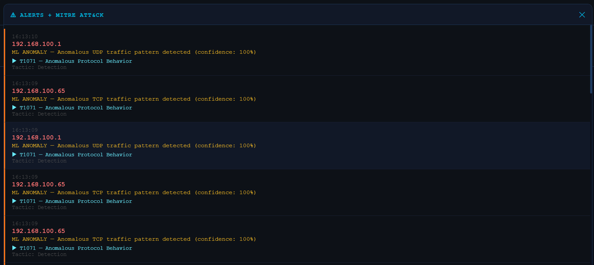
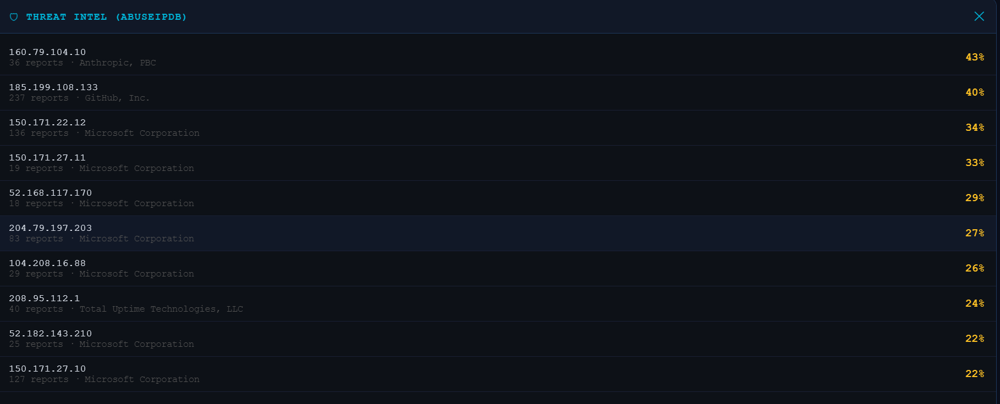
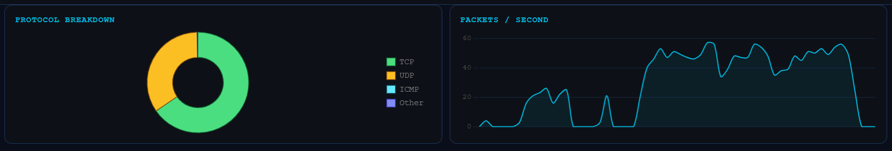

# ⚡ Network Packet Analyzer

> An AI-powered network security monitoring tool with real-time threat detection,
> MITRE ATT&CK mapping, ML anomaly detection and a live web dashboard.


---

## 🔍 What it does

A production-grade network packet analyzer that captures live traffic,
detects threats in real time, and displays everything in a browser-based dashboard.
Built from scratch using Python, Scapy, and Flask — no tutorials, no copy-paste.

---

## 📸 Screenshots

### Full Dashboard


### Alerts + MITRE ATT&CK


### Threat Intelligence


### Live Charts


---

## ✨ Features

| Feature | Description |
|---|---|
| 📡 **Live packet capture** | Real-time TCP/UDP/ICMP capture using Scapy |
| 🌍 **GeoIP + reverse DNS** | Country, city and hostname for every IP |
| 🛡 **Threat intelligence** | AbuseIPDB integration — flags malicious IPs with score |
| ⚔️ **MITRE ATT&CK mapping** | Every alert tagged with technique ID and tactic |
| 🤖 **ML anomaly detection** | Isolation Forest baseline model flags abnormal traffic |
| 📊 **Live charts** | Protocol breakdown + packets/sec timeline |
| ⚠️ **Email alerts** | Gmail SMTP notifications on critical detections |
| 💾 **PCAP export** | Download captures directly openable in Wireshark |
| 🐳 **Docker ready** | One-command deployment with docker-compose |
| ⚙️ **YAML config** | All settings in config.yaml — no code changes needed |

---

## 🖥 Dashboard

The web dashboard runs at `http://localhost:5000` and includes:

- **Live packet feed** — color coded by threat level (CRITICAL / HIGH / MEDIUM / NORMAL)
- **Alerts panel** — real-time security alerts with MITRE ATT&CK technique IDs
- **Threat intel panel** — AbuseIPDB scores for every external IP seen
- **ML anomaly panel** — Isolation Forest training status and anomaly count
- **Top talkers** — most active IPs on your network
- **Protocol chart** — live doughnut chart of TCP/UDP/ICMP split
- **Timeline chart** — packets per second over the last 60 seconds
- **Click to expand** — every panel expands to full screen on click

---

## 🚀 Quick start

### Option 1 — Docker (recommended)

```bash
git clone https://github.com/roronoazoro-hacked/network-packet-analyzer
cd network-packet-analyzer
cp .env.example .env
docker-compose up
```

Open `http://localhost:5000`

### Option 2 — Direct Python (Windows)

```bash
git clone https://github.com/roronoazoro-hacked/network-packet-analyzer
cd network-packet-analyzer
python -m venv .venv
.venv\Scripts\activate
pip install -r requirements.txt
python main.py
```

Open `http://localhost:5000`

> **Note:** Must be run as Administrator on Windows for raw socket access.
> Install [Npcap](https://npcap.com) before running.

---

## ⚙️ Configuration

All settings are in `config.yaml` — no code changes needed:

```yaml
network:
  interface: '\Device\NPF_{your-interface}'
  filter: "ip"

detection:
  port_scan_threshold: 15
  risky_ports: [22, 23, 445, 3389, 4444]

ml:
  baseline_duration: 120
  contamination: 0.05

alerts:
  email:
    enabled: true
    cooldown_seconds: 300
```

---

## 🔑 Environment variables

Copy `.env.example` to `.env` and fill in your details:

ABUSEIPDB_KEY=your_abuseipdb_key
EMAIL_SENDER=your@gmail.com
EMAIL_PASSWORD=your_16_char_app_password
EMAIL_RECEIVER=your@gmail.com

Get a free AbuseIPDB key at https://www.abuseipdb.com/register

---

## 🎯 Detection capabilities

| Detection | Method | MITRE Technique |
|---|---|---|
| Port scan | >15 unique ports from one IP | T1046 — Network Service Discovery |
| Malicious IP | AbuseIPDB score >20% | T1071 — Application Layer Protocol |
| RDP connection | Port 3389 traffic | T1021.001 — Remote Services: RDP |
| SSH connection | Port 22 traffic | T1021.004 — Remote Services: SSH |
| SMB traffic | Port 445/139 | T1021.002 — Remote Services: SMB |
| ML anomaly | Isolation Forest deviation | T1071 — Anomalous Protocol Behavior |

---

## 🏗 Architecture
main.py          — Flask server + packet handling + threading
sniffer.py       — Scapy packet capture
geoip.py         — IP geolocation via ip-api.com
threat_intel.py  — AbuseIPDB threat intelligence
mitre.py         — MITRE ATT&CK technique mapping
anomaly.py       — ML anomaly detection (Isolation Forest)
emailer.py       — Gmail SMTP alert notifications
logger.py        — CSV packet logging
config.py        — YAML config loader
templates/
index.html     — Web dashboard (vanilla JS + Chart.js)

---

## 🛠 Tech stack

- **Python 3.11** — core language
- **Scapy** — packet capture and protocol decoding
- **Flask** — web server and REST API
- **scikit-learn** — Isolation Forest anomaly detection
- **Chart.js** — live dashboard charts
- **AbuseIPDB API** — threat intelligence
- **ip-api.com** — IP geolocation
- **Docker** — containerisation

---

## 🔒 Security note

This tool is intended for use on networks you own or have explicit permission
to monitor. Unauthorized packet capture may be illegal in your jurisdiction.

---

## 👨‍💻 Author

**Dhrumil Chheda**
- GitHub: [@roronoazoro-hacked](https://github.com/roronoazoro-hacked)
- LinkedIn: [Add your LinkedIn URL here]

---

## 📄 License

MIT License — see [LICENSE](LICENSE) for details.